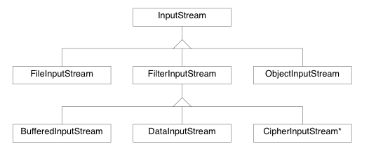
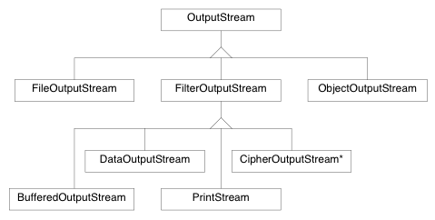

# EDA095
## Theory
### internet protocol suite
The internet protocol suite is the conceptual model and set of communications protocols used on the internet and similar computer networks. It is commonly known as TCP/IP because the original protocols in the suite are the Transmission Control Protocol (TCP) and the internet Protocol (IP).
The internet protocol suite is devide in several layers just like the OSI arhitecture although there is a recemblance between the two arhitectures at first glance they should not be compared to eachother because of difference in goals and relative importance of strict layering. 

The layers in TCP/IP are: 

**Application layer**: The application layer includes the protocols used by most applications for providing user services or exchanging application data. An example is HTTP. 

**Transport layer**: The transport layer establishes basic data channels that applications use for task-specific data exchange. The layer establishes process-to-process connectivity, meaning it provides end-to-end services that are independent of the structure of user data and the logistics of exchanging information for any particular specific purpose. Its responsibility includes end-to-end message transfer independent of the underlying network, along with error control, segmentation, flow control, congestion control, and application addressing (port numbers). End-to-end message transmission or connecting applications at the transport layer can be categorized as either connection-oriented, implemented in TCP, or connectionless, implemented in UDP.

**Internet layre**: The internet layer has the responsibility of sending packets across potentially multiple networks. internet requires sending data from the source network to the destination network. This process is called routing. An example is internet Control Message Protocol (ICMP), which is a support protocol to the IP layer. It is used to send error message but is mostly used in our courses as a way of checking connectivity (ping) and displaying the path through the internet (Traceroute). 

**Link layer**: The link layer has the networking scope of the local network connection to which a host is attached. It is the lowest component layer of the internet protocols, as TCP/IP is designed to be hardware independent. As a result, TCP/IP may be implemented on top of virtually any hardware networking technology. The link layer is used to move packets between the internet layer interfaces of two different hosts on the same link.
### IP
IP has the task of delivering packets from the source host to the destination host solely based on the IP addresses in the packet headers. For this purpose, IP defines packet structures that encapsulate the data to be delivered. It also defines addressing methods that are used to label the datagram with source and destination information.
Each datagram has two components: a header and a payload. The IP header is tagged with the source IP address, the destination IP address, and other meta-data needed to route and deliver the datagram. The payload is the data that is transported. This method of nesting the data payload in a packet with a header is called encapsulation.
The design of the internet protocols is based on the end-to-end principle. The network infrastructure is considered inherently unreliable at any single network element or transmission medium and is dynamic in terms of availability of links and nodes. No central monitoring or performance measurement facility exists that tracks or maintains the state of the network. For the benefit of reducing network complexity, the intelligence in the network is purposely located in the end nodes.
As a consequence of this design, the internet Protocol only provides best-effort delivery and its service is characterized as unreliable.
#### TCP
The Transmission Control Protocol (TCP) is one of the main protocols of the internet protocol suite. It originated in the initial network implementation in which it complemented the internet Protocol (IP).
TCP provides reliable, ordered, and error-checked delivery of a stream of octets between applications running on hosts communicating by an IP network.
Transmission Control Protocol accepts data from a data stream, divides it into chunks, and adds a TCP header creating a TCP segment. The TCP segment is then encapsulated into an internet Protocol (IP) datagram, and exchanged with peers.
A TCP segment consists of a segment header and a data section. The TCP header contains 10 mandatory fields, and an optional extension field (Options, pink background in table).
The data section follows the header. Its contents are the payload data carried for the application. The length of the data section is not specified in the TCP segment header. It can be calculated by subtracting the combined length of the TCP header and the encapsulating IP header from the total IP datagram length (specified in the IP header).
TCP protocol operations may be divided into three phases. Connections must be properly established in a multi-step handshake process (connection establishment) before entering the data transfer phase. After data transmission is completed, the connection termination closes established virtual circuits and releases all allocated resources.
#### UDP
User Datagram Protocol (UDP) is one of the main protocols of the internet protocol suite. 
UDP uses a simple connectionless transmission model with a minimum of protocol mechanism. UDP provides checksums for data integrity, and port numbers for addressing different functions at the source and destination of the datagram. It has no handshaking dialogues, and thus exposes the user's program to any unreliability of the underlying network: there is no guarantee of delivery, ordering, or duplicate protection.
UDP is suitable for purposes where error checking and correction are either not necessary or are performed in the application; UDP avoids the overhead of such processing at the level of the network interface. Time-sensitive applications often use UDP because dropping packets is preferable to waiting for delayed packets, which may not be an option in a real-time system.
The UDP header consists of 4 fields, each of which is 2 bytes (16 bits). The use of the fields "Checksum" and "Source port" is optional in IPv4. In IPv6 the checksum field is mandatory.
### HTTP && URL, URI
The Hypertext Transfer Protocol (HTTP) is an application protocol for distributed, collaborative, and hypermedia information systems. HTTP is the foundation of data communication for the World Wide Web.
HTTP functions as a request–response protocol in the client–server computing model. A web browser, for example, may be the client and an application running on a computer hosting a website may be the server. The client submits an HTTP request message to the server. The server, which provides resources such as HTML files and other content, or performs other functions on behalf of the client, returns a response message to the client. The response contains completion status information about the request and may also contain requested content in its message body.
HTTP has several request methods: GET, POST, PUT and DELETE. 

The GET method requests a representation of the specified resource. Requests using GET should only retrieve data and should have no other effect.

The POST method requests that the server accept the entity enclosed in the request as a new subordinate of the web resource identified by the URI.

The PUT method requests that the enclosed entity be stored under the supplied URI. If the URI refers to an already existing resource, it is modified; if the URI does not point to an existing resource, then the server can create the resource with that URI.

The DELETE method deletes the specified resource.

HTTP is an application layer protocol designed within the framework of the internet protocol suite. Its definition presumes an underlying and reliable transport layer protocol, and Transmission Control Protocol (TCP) is commonly used. However HTTP can be adapted to use unreliable protocols such as the User Datagram Protocol (UDP).


A Uniform Resource Locator (URL), colloquially termed a web address, is a reference to a web resource that specifies its location on a computer network and a mechanism for retrieving it. A URL is a specific type of Uniform Resource Identifier (URI), although many people use the two terms interchangeably. URLs occur most commonly to reference web pages (http), but are also used for file transfer (ftp), email (mailto), database access (JDBC), and many other applications.

### HTML, CSS, DOM, json, XML
Hypertext Markup Language (HTML) is the standard markup language for creating web pages and web applications. With Cascading Style Sheets (CSS) and JavaScript it forms a triad of cornerstone technologies for the World Wide Web. Web browsers receive HTML documents from a web-server or from local storage and render them into multimedia web pages. HTML describes the structure of a web page semantically and originally included cues for the appearance of the document.

HTML elements are the building blocks of HTML pages. With HTML constructs, images and other objects, such as interactive forms, may be embedded into the rendered page. It provides a means to create structured documents by denoting structural semantics for text such as headings, paragraphs, lists, links, quotes and other items. HTML elements are delineated by tags, written using angle brackets. Tags such as `` `` and ``<input />`` introduce content into the page directly. Others such as ``<p>...</p>`` surround and provide information about document text and may include other tags as sub-elements. Browsers do not display the HTML tags, but use them to interpret the content of the page.

The Document Object Model (DOM) is a cross-platform and language-independent application programming interface that treats an HTML, XHTML, or XML document as a tree structure wherein each node is an object representing a part of the document. The objects can be manipulated programmatically and any visible changes occurring as a result may then be reflected in the display of the document.

SAX (Simple API for XML) is an event-driven online algorithm for parsing XML documents. SAX provides a mechanism for reading data from an XML document that is an alternative to that provided by the Document Object Model (DOM). Where the DOM operates on the document as a whole, i.e. building the full AST of XML document for convenience of the user, SAX parsers operate on each piece of the XML document sequentially, issuing parsing events while making single pass through the input stream. Unlike DOM, there is no formal specification for SAX. The Java implementation of SAX is considered to be normative. SAX processes documents state-independently, in contrast to DOM which is used for state-dependent processing of XML documents. 

JavaScript Object Notation (JSON) is an open-standard file format that uses human-readable text to transmit data objects consisting of attribute–value pairs and array data types (or any other serializable value). It is a very common data format used for asynchronous browser/server communication, including as a replacement for XML in some AJAX-style systems.

Extensible Markup Language (XML) is a markup language that defines a set of rules for encoding documents in a format that is both human-readable and machine-readable. The design goals of XML emphasize simplicity, generality, and usability across the internet. It is a textual data format with strong support via Unicode for different human languages. Although the design of XML focuses on documents, the language is widely used for the representation of arbitrary data structures such as those used in web services.
Several schema systems exist to aid in the definition of XML-based languages, while programmers have developed many application programming interfaces (APIs) to aid the processing of XML data.
### Unicode && UTF-8
Unicode is a computing industry standard for the consistent encoding, representation, and handling of text expressed in most of the world's writing systems. Unicode can be implemented by different character encodings. The Unicode standard defines UTF-8, UTF-16, and UTF-32, and several other encodings are in use. The most commonly used encodings are UTF-8, UTF-16 and UCS-2, a precursor of UTF-16.

The encoding is variable-length and uses 8-bit code units. It was designed for backward compatibility with ASCII and to avoid the complications of endianness(little and big endian) and byte order marks in the alternative UTF-16 and UTF-32 encodings. UTF-8 encodes each of the 1,112,064 valid code points in Unicode using one to four 8-bit bytes. Code points with lower numerical values, which tend to occur more frequently, are encoded using fewer bytes. The first 128 characters of Unicode, which correspond one-to-one with ASCII, are encoded using a single octet with the same binary value as ASCII, so that valid ASCII text is valid UTF-8-encoded Unicode as well. Since ASCII bytes do not occur when encoding non-ASCII code points into UTF-8, UTF-8 is safe to use within most programming and document languages that interpret certain ASCII characters in a special way, such as "/" in filenames, "\" in escape sequences, and "%" in printf.
### JSP && Servlets
JSP is a webpage scripting language that can generate dynamic content while Servlets are Java programs that are already compiled which also creates dynamic web content. Servlets run faster compared to JSP. JSP can be compiled into Java Servlets. It's easier to code in JSP than in Java Servlets. 

### Thread(s)
A thread is an execution context, which is all the information a CPU needs to execute a stream of instructions. A CPU is giving you the illusion that it's doing multiple computations at the same time. It does that by spending a bit of time on each computation. It can do that because it has an execution context for each computation.

**Single Thread:** is the most basic way of executing a program, one instruction at the time. When a instruction has been complete the next can be started.

**Multithreding:** is a widespread programming and execution model that allows multiple threads to exist within the context of one process. These threads share the process's resources, but are able to execute independently. The threaded programming model provides developers with a useful abstraction of concurrent execution. An example of this is when person A and person B reads the same book. Each person have a peace of paper with the current pagenumber(the program counter PC). Because of the singularity of the book person A and B may not read the book at the same time but each person can only read the book during short intervals because they get tired. The time of person A and B reading the book will be the same but becuase of the good utelization of the resources the total time of the process where person A and B reading the book will be shorter.

**Multicast** is group communication where information is addressed to a group of destination computers simultaneously. 
#### Syncronization
Synchronization refers to one of two distinct but related concepts: synchronization of processes, and synchronization of data. Process synchronization refers to the idea that multiple processes are to join up or handshake at a certain point, in order to reach an agreement or commit to a certain sequence of action. Data synchronization refers to the idea of keeping multiple copies of a dataset in coherence with one another, or to maintain data integrity. 
track to synchronization we wont get unidentified behavior when programing with several threads. 


To acomplish this we use the keyword: Synchronized in java. 
```java
public synchronized void DoStuff(){
	...
}
```
A more sutable example is when dealing with data storage.
```java
public class storage{
	private int data[] = new int[10];

	public synchronized void setNumber(int n){
		...
	}

	public synchronized int getNumber(int index){
		...
	}
}
```
The class above is secure to unidentified behavior due to thread interactions. Examples of unidentified behavior due to thread interaction and synchronization is listed below.

* **Mutual exclusion** is a property of concurrency control, which is instituted for the purpose of preventing race conditions; it is the requirement that one thread of execution never enter its critical section at the same time that another concurrent thread of execution enters its own critical section. 

* **Deadlock** is a state in which each member of a group of actions, is waiting for some other member to release a lock which results in no action in performed.

* **Busy wait** is when a thread continuesly checking if a condition is met, this is almost always a bad implementation of a thread because it allocates cpu power when non should be needed.

To solve some of the problems or all is to 1. **Don't create a circular dependency in any synchronized class**, this solves the problem of deadlocks. 2. Use the functions `wait()` `notify()` and `notifyAll()`. These are very useful ways of managing cpu power and overall performance of threads. 

The `wait()` sets a thread to a "Non-runnable state" this tells the JVM to not schedule any more work for the thread in question.

```java
public class storage{
	private ArrayList<job> jobList = new ArrayList();

	public synchronized void addJob(job j){
		jobList.add(j);		
		notify(); // sets an arbitrary thread which been put in a non-runnable state to runnable state.
	}

	public synchronized job getJob(){
		if(jobList.size() == 0)
			wait(); // sets the thread to the non-runnable state.
		else
			return jobList.pop();
	}
}
```
Why didn't the mad man write notifyAll()? - because it would be point less to notify all threads waiting for a job if only one of them are able to get a job, waste of cpu power. 
- But if there is more jobs in the list? 
- then they will wait as every other swede in the world until they get access to the function and then get a job or be put in a non runnable state. 
- When sould you use notifyAll() then if you're so clever? 
- here:

```java
public class storage{
	....
	public synchronized void addListOfJobs(list l){
		jobList.addAll(l);
		notifyAll();
	}
}
```
Because now one **or more** jobs will be added to the current list of jobs. If we were to use the previously stated solution we would have several inactive threads consuming memory and have a single thread program again if no new threads are created. - Non efficient. 

## Programming 
### Java I/O
**I/O:** Input/Output. 

InputStream and OutputStream is to abstract different ways to input and output: whether the stream is a file, a web page, or the screen shouldn't matter. All that matters is that you receive information from the stream (or send information into that stream.). 

A **InputStream** is used for reading data from a source.

A **OutputStream** is used to send data to a source. 

You've already used input and output streams before, perhaps without knowing it, when reading the information in a file. 
An example of doing this with the most basic form of I/O is seen below. 

```java
socket s = ....;

InputStream in =s.getInputStream(); 
Byte[] arr = new Byte[1024];
while(in.read(arr)!=-1){ /* reads the next set of bytes from the file and stores 
			   * it in the variable a, aslong as the value is != -1 */
	..... 		  //do something with the input from read
}
in.close();
```

```java
OutputStream out = new FileOutputStream("Path to file");
int data[] = {.....};
for(int i : data){
	out.write(i);
}
out.flush();
output.close();
```
The first example will read all chars in the file defined in the FileInputStream constructor. 

The second example will write all ints stored in the data array to a file defined in the FileOutputStream constructor. 

There are several classes that extends the features found in these basic I/O classes. They can be seen below and their relationship to the OutputStream and InputStream. 




**Note** - These classes needs a I/O class in the constructor.  
### Threads
#### Runnable
" The Runnable interface should be implemented by any class whose instances are intended to be executed by a thread. The class must define a method of no arguments called run. " - java documentation. 

When implementing the runnable interface we create another execution context. The class thats implements the runnable interface is a thread i.e. a execution context. In the method run the code each thread should execute is written. 

In the example below is a java implementation of the runnable interface. Note that in main we start the class implementing Runnable by creating a Thread and placeing the class we've implemented as a input parameter and then calls Thread.start(). This will execute the code in the run method in the class we've implemented.  

```java
public class HelloRunnable implements Runnable {

	public void run() {
		System.out.println("Hello from a thread!");
	}

}

public static void main(String args[]) {
	(new Thread(new HelloRunnable())).start();
}

```


#### Thread
Thread is a class thats extends the runnable interface. 

" The Thread class itself implements Runnable, though its run method does nothing. An application can subclass Thread, providing its own implementation of run. - java documentation. 

So when extending the Thread class we ovverride the run method to be able to use the execution context. In run we implement the code we want to execute and then as seen in the example below we call our new class and use the thread method start() to start the execution of our code. 
```java
public class HelloThread extends Thread {

	public void run() {
		System.out.println("Hello from a thread!");
	}

}

public static void main(String args[]) {
	(new HelloThread()).start();
}

```

#### Thread pools A.K.A Executionservice
Thread pools address two different problems: they usually provide improved performance when executing large numbers of asynchronous tasks, due to reduced per-task invocation overhead, and they provide a means of bounding and managing the resources, including threads, consumed when executing a collection of tasks. Each ThreadPoolExecutor also maintains some basic statistics, such as the number of completed tasks. 

```java
ExecutorService executor = Executors.newFixedThreadPool(10);
```
A ExecutorService can execute class implementing Runnable and Callable.

##### Callable && Future
The Callable interface is similar to Runnable, in that both are designed for classes whose instances are potentially executed by another thread. A Runnable, however, does not return a result and cannot throw a checked exception. 

When we want to receive a result from the callable thread we create a "promise for future results" - a Future object. The execution service adds a task and when the task has been performed the execution service returns the result to a predefined future object as seen below.

```java
List<Task> tasks; // filled with work to be done
ExecutorService pool = Executors.newFixedThreadPool(16); // Creates a threadpool with 16 active threads to compute results. 
List<Future<boolean>> futures = new ArrayList(); // a storage for the results generated by the threadpool
for(Task t: tasks){
	Future<boolean> f= pool.submit(t); //A task is submitted to the threadpool and is executed when possible by the threadpool. 
	futures.add(f);
}
for(Future f : futures){
	system.out.println(f.get()); //Waits if necessary for the computation to complete, and then retrieves and prints the result
}
pool.shutdown();

```
### Network programing
#### Socket & ServerSocket (TCP)
A socket is one end-point of a two-way communication link between two programs running on a network. Socket classes are used to represent the connection between a client program and a server program. The socket requires a host, a address to the socket(ipv4 or ipv6), and a port number which the socket is listed on.
A ServerSocket is the server side socket, it listen on a port for incoming connections.  
A server needs at least 3 classes, The main, accept thread and the information thread. 
The main class starts the threads accept and information. The accept class waits for a client socket to try to connect to it, when it does it starts a information transfer between the two sockets. 
A accept thread may look something like this:
```java
public Accept() {...}

public void run() {
	try {
		ServerSocket ss = new ServerSocket(7878);
		while (true) {
			Socket s = ss.accept();
			// Start the iformation trading thread
		}
	} catch(IOException e) {
		....
	}
}
```
This just start the information flow between two machines, to actually do something well need to create a information channel between the two. Like this: 
```java
public ClientThread(Socket sock) {
	this.sock = sock;
}
public void run() {
	try {
		byte[] latest = null;
		InputStream inp = sock.getInputStream();
		OutputStream outp = sock.getOutputStream();
		// Do something with the information eather lisen to the input or send output to the client or create two new threads and do both. 
	} catch(IOException e) {
		....
	}
}
```
**Note** - by having a socket we can get a InputStream and an OutputStream to communicate with the other end node. 
The main program should look something like this:
```java
Public static void main(String args[]) {
	new Accept().start();
}
```
#### DatagramSocket (UDP)
A datagram socket is the sending or receiving point for a packet delivery service. Each packet sent or received on a datagram socket is individually addressed and routed. Multiple packets sent from one machine to another may be routed differently, and may arrive in any order.
The datagram socket doesn't guarantee a package delivery and it doesn't need a Accept class because it doesn't guarantee a successful delivery. 

A program that sends information may look something like this: 
```java
public static void main(String[] args) throws Exception {  
	DatagramSocket ds = new DatagramSocket();  
	String str = "Welcome java";  
	InetAddress ip = InetAddress.getByName("127.0.0.1");  

	DatagramPacket dp = new DatagramPacket(str.getBytes(), str.length(), ip, 3000);  
	ds.send(dp);  
	ds.close();  
}

```
And a class at the receiving end may look like this:

```java
	public static void main(String[] args) throws Exception {  
		DatagramSocket ds = new DatagramSocket(3000);  
		byte[] buf = new byte[1024];  		
		DatagramPacket dp = new DatagramPacket(buf, 1024);  
		ds.receive(dp); //Stores the information received in the DatagramPacket created above.  
		String str = new String(dp.getData(), 0, dp.getLength());  
		System.out.println(str);  
		ds.close();  
	}  
```  

#### MulticastSocket
When one sends a message to a multicast group, all subscribing recipients to that host and port receive the message (within the time-to-live range of the packet, see below). The socket needn't be a member of the multicast group to send messages to it.

When a socket subscribes to a multicast group/port, it receives datagrams sent by other hosts to the group/port, as do all other members of the group and port. A socket relinquishes membership in a group by the leaveGroup(InetAddress addr) method. Multiple MulticastSockets may subscribe to a multicast group and port concurrently, and they will all receive group datagrams. 

**TTL** - The IP multicast routing protocol uses the **Time To Live** field of IP datagrams to decide how "far" a multicast packet should be forwarded from its source. 

```java
// join a Multicast group and send the group salutations
...
String msg = "Hello";
int port = 4000; 
String IP = "10.2.196.35";
InetAddress group = InetAddress.getByName(IP);
MulticastSocket s = new MulticastSocket(port);
s.joinGroup(group);
DatagramPacket hi = new DatagramPacket(msg.getBytes(), msg.length(),
		group, port);
s.send(hi);
// get a response 
byte[] buf = new byte[1000];
DatagramPacket recv = new DatagramPacket(buf, buf.length);
s.receive(recv);
...
Do stuff with the response
....
// Leaving a multycast group. 
s.leaveGroup(group);
```
**Remember** - A node may be connected to several other through other multicast nodes. 

## Member? 
### Threads
* implementing runnable is only used when you need to extend an other class.
* Callable is a thread interface which returns a value after the execution.
* ExecutionService is a effective way of scheduling multiple threads for large calculation or complex tasks.
**Ohh I Member!**
### Sockets
* A Socket is a TCP connection.
* A DatagramSocket and MulticastSocket is a UDP socket and therefore does not guarantee delivery.
**Ohh I Member!**
