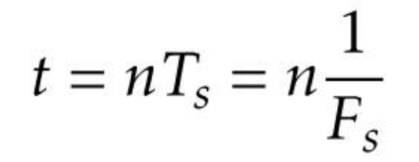
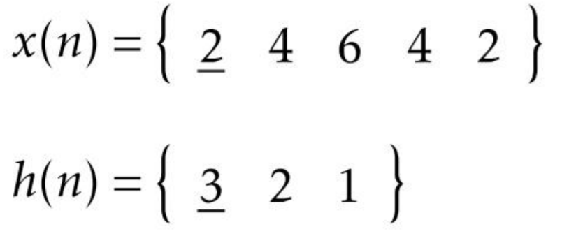
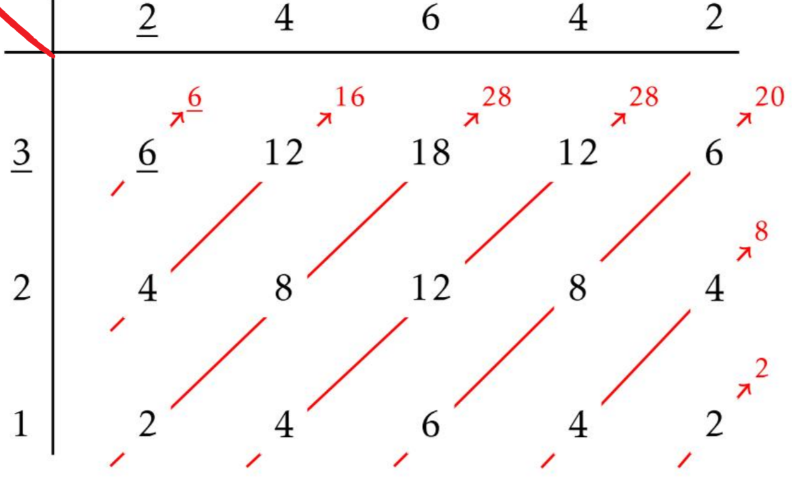
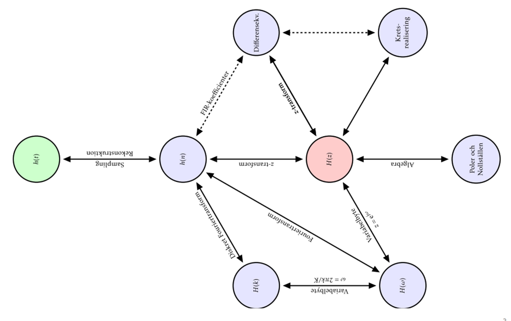
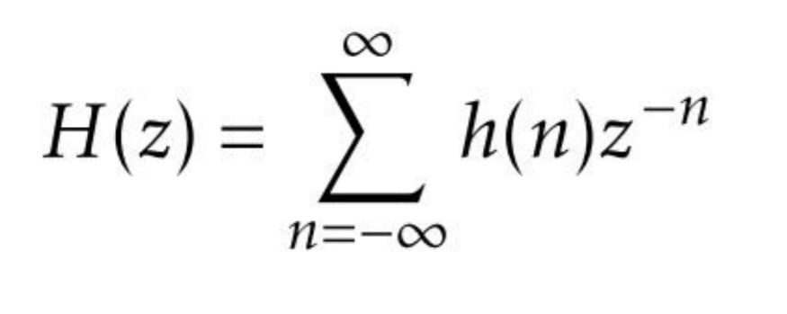

# EIT265
## Sampling
Sampling is when you observe a signal at a given interval.
Given a input signal x(n) = {1 0 0 3 6}, the numbers in the array is samples of the input signal gathered at a constant speed or interval by a A/D (Analog to digital) converter.

The samples is a numerical representation of the input signals amplitude and are used to predict the output signal given the transform function.
This is described in the formula below:

F\_s is hertz and T\_s is in seconds. 
T\_s is the time period betwoon each sample and F\_s is the sampling rate.

The spectrum of a digital signal is periodic with the period f=1 or omega = 2pi. Becuase the period is f=1 every component that we have within -0.5 and 0.5 (or 0 and pi) in frequencys will occur in any constant integer added or subtracted.   

**Aliasing** - Is when the provided signal is outside of the spectrum described above. 

**Nyquist theorem** - The sampling rate should be greater than 2 times the frequency to provdide good samplig.  By following this theorem we will avoid aliasing. 

The discrete time input signal, X(f), is equal to the continous time input signal multiplied by the sample rate, X(F)*F\_s. This is how we use the Fourier transform for continous signals. This only applies if the Nyquist theorem is fulfilled.  

### Ideal reconstructor
First we take our digital output signal, *y(t)*, and multiply it with a dirac pulses, which transforms our *discrete time signal* into a *continous signal*. However, our continous time signal looks like a discrete one. To form an output for a low pass filter one sets a **Time multiplicator** in front of the filter. The filtering then produces a more "smooth" continous time signal.

In practice the usual reconstruction is made with Sample-and-hold. The reason is that this method is a lot less noise sensitive. The big difference between Sample-and-hold and *Ideal reconstruction* is that instead of going down to zero between each signal, we sample and hold that signal until the next sample level. This is equival to filtering our contious time with a rectangular impulse response. Then, just as in the prevous method, we let it pass through a low pass filter.
The consequence of using sample and hold is that there will be small changes in the amplitude.

* **Interpolation** - *increase sample rate with factor I*
	* F\_s' = F\_s*I
* **Decimation** - *reduce the sample rate with a factor D*
	* F\_s' = F\_s/D
Chattkonversationen är avslutad
Skriv ett meddelande ...

## Convolution
Given an input signal x(n) and a impulse response h(n) we can determine the output signal y(n) by convolving them together. x(n)\*h(n) = y(n). The convolution process is commutative which is the same as saying that the order of the factors doesn't matter. This is done by using the function below. 

Note: the position of the zero index. This is the numerical value denoted by a underscore or an arrow. 

Below is an exampel of how to convolve with pen and paper.

Note: the sum of each anti-diagonal(bottom left to top right) is the corresponding value in the output signal. Also note in which anti-diagonal the zero indices meet, this is the new zero index of the output signal.

### Circular convolution
Circular convolution is just the same as normal convolution with some added steps.
1. Edit the input signal to match the convolution length, seen at the convolution sign. Either by adding zeroes or cutting off the signal. The zero index needs to be in the given interval.  
2. (inversion if needed), flip the order of the array. This is to be done if there is a minus sign in the signal input parameter ex. x(-n)\*h(n), this would require the input array to be inversed. 
3. set the zero index to be the first place in the array, then the sequential numbers. After that add the original first index and the sequential numbers up to the zero index. 

Ex.
{1 2 3 __4__ 5} => {__4__ 5 1 2 3}
4. Summarize the anti-diagonal as seen below.

## Transfer function, H(z) 

The transfer function, or system function, is the most usefull tool in this course. As seen abow the transfer function can easealy be converted to almost all other states. 

A convolution of discrete-time signals becomes multiplication in the z-state. 
### Z-transform
The definition of Z-transformation converts a discrete-time signal into a complex frequency domain representation. The definition is seen below: 

All z-transformations well ever need is predefined in the formula collection provided by the course administrator. 
### Inverse z-transform

## Poles and zeroes
"What you can find in strip clubs" - Kabbage
Given the transfere function the poles and zeroes can be found by finding the roots to the denominators and the numerators polynomial.
The denominators polynomial roots is the functions poles and the functions poles is the denominator polynomials roots. 
### pole-zero diagram
This diagram shows the location of the systems poles and zeroes. The zeroes is represented by cirles, while the poles is represented by x:s.

The y-axis is **imaginary**, while the x-axis is **real**. 

**If the number of poles is greater or equal to the number of zeros, the sysytem is causal. This applies goenerally for both casual FIR and IIR filters.**
## Discrete Time Fourier-transformation, H(omega)
Is when we transform a function in the z-state and transforme it to the frequency domane. 
When we have periodic signals it is a good ide to use the Fourier-transformation.  
A fourire-transformation exists if x(n) is stable, the sum of x(n) is finite. 
## LTI-systems (Linear and time invariant systems)
To determine the outputsignal from a LTI system we have two cases:
1. The input signal is casual and the z-transform exists.
we solve this by using the z-transformation and multipying the transferfunction with the input fuction. 
2. the input signal has non-causal part
We solve this by susing the convolution sum, h(n)\*x(n).

If we have a linear phase system we will delay all frequencys with the same number of samples. 

### Filters
#### Low pass filter
A low pass filtre which blocks high frequencys only lets low frequencys pass. 
#### High pass filter
A high pass filtre which blocks low frequencys only lets high frequencys pass. 
#### IIR (Infinite Impulse Response)
A IIR-filter is always stable if its zeroes and poles is within the unit circle. 
A **notch IIR** filter is when the zeroes lies on the unit circle and the poles and the zeroes lies close together. We use this to limit the amplitude to become more stable. 
* Has feedback. 
* The impulse response is infinete duration. 
* A IIR filter cannot have linear phase. 

#### FIR (Finite Impulse Response)
A FIR-filter has all their zeroes at the origin anda are always BIBO-stable: h(n) has a finite duration and the sum of abs(h(n)) is always limited, =/= infinity. 
* Has no feedback. 
* The transfer function of a FIR filter is called a **Notch FIR** filter.
* A FIR filter with linear phase has a symmetric impulse response. 
* FIR may have linear phase. 
* The impluse response is of finite duration. 

## Discrete Fourier transforms, H(k) 
H(k) is a sample verison of H(omega). 

# Words
* causal - The time starts at zero, the sum starts at index zero not minus infinity.  
* ROC, Region of convergence - for which z the sum converges. 
